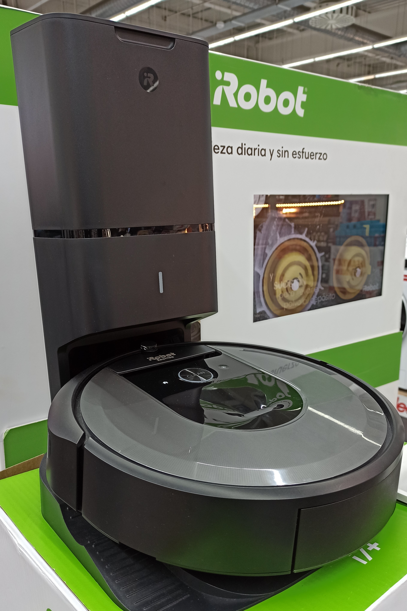

!!!figure right

---

The iRobot Roomba i7+, one of a number of robot vacuum cleaners manufactured by iRobot. [Synanthrope, copyleft]
!!!

**Cleaner robots** are a type of robot created with the purpose of cleaning various surfaces. These often, but not always, resemble some sort of cleaning appliance. Cleaner robots of this type will most likely resemble a vacuum cleaner, dubbed a robovac.

It should be noted that cleaner robots in fiction are much more heavily anthropomorphized than real cleaning robots.

## In popular culture

### In real life

The concept of an autonomous robotic vacuum cleaner was first posited in 1956 by sci-fi author [Robert A. Heinlein](https://en.wikipedia.org/wiki/Robert_A._Heinlein) in [_The Door into Summer_](https://en.wikipedia.org/wiki/The_Door_into_Summer), a serial in _The Magazine of Fantasy & Science Fiction_.

Consumer appliances company Whirlpool demonstrated a robotic vacuum cleaner at the American National Exhibition in 1959, however did not release it to consumers.[^1]

The first patent for robotic swimming pool cleaner was issued in 1967, hough the first commercially available model wasn't released until 1974.[^4] Dolphin, released by Maytronics in 1983, was the first robotic pool cleaner that had controlled, independent movement.

In 1996, Electrolux introduced the first commercially available robotic vacuum, named Trilobite, though it was not made available for purchase until 2001.[^2] It was a commercial failure and the second version, Trilobite 2.0, would be the last.

Also in 2001, Dyson showcased their concept for a robot vacuum cleaner, however this was also never released to consumers.

In 2002, iRobot launched the first Roomba, which was commercially successful. iRobot has subsequently been credited for creating the home cleaning robot industry. iRobot launched the Scooba, a wet mopping robot, in 2004. Some later Roomba models would be capable of both vacuuming and mopping.

A number of companies now manufacture robot vacuum and mopping robots, helping to reduce prices and making them more readily available. In 2016, iRobot estimated that 20 percent of vacuum cleaners in the world were robot vacuums.[^3]

In 2025, AI company 1X announced the Neo, an [android] intended for domestic tasks including cleaning.

[android]: {{ 'android' | pageUrl }}

[^1]: ["This American Expo Invaded Russia With Shiny New Tech in 1959"](https://paleofuture.com/blog/2014/7/24/the-all-american-expo-that-invaded-cold-war-russia), _Paleofuture_.

[^2]: _[Robovac, History of Robotic Vacuum Cleaners](http://www.vacuumcleanerhistory.com/vacuum-cleaner-development/history-of-robotic-vacuum-cleaner/)_

[^3]: ["iRobot says 20 percent of the world’s vacuums are now robots"](https://techcrunch.com/2016/11/07/irobot-says-20-percent-of-the-worlds-vacuums-are-now-robots/), _TechCrunch_

[^4]: ["The Birth of the Automatic Pool Cleaner"](https://www.aquamagazine.com/service/article/15121193/the-birth-of-the-automatic-pool-cleaner), _Aqua Magazine_

### In media

Cleaning robots are popular in science fiction and childrens media, such as MO from _WALL-E_, QT from _Space Dandy_, and Noo-Noo from _Teletubbies_, who are each sentient vacuum cleaners.

Rosie from _The Jetsons_, one of the earliest examples of a cleaning robot in television media, is a housemaid capable of cooking and other tasks in addition to cleaning.

"Zima Blue", an episode of _Love, Death & Robots_' second season, features an interview with the titular Zima Blue, a reclusive artist who is assumed by humanity to be a [cyborg]. He reveals through the interview that he is actually an advanced [android], augmented over generations by a number of previous owners. He reveals his final artwork after the interview: a swimming pool, in which he casts off his modifications and returns to his original existence as a swimming pool cleaning robot.

In live-action media, Kryton from the British sci-fi comedy series _Red Dwarf_ is initially found as a cleaning android. He diversifies his programming as the series progresses, although maintains a love of cleanliness.

[cyborg]: {{ 'Cyborg' | pageUrl }}
[android]: {{ 'Android' | pageUrl }}

## In the robotkin community

Some robotkin identify with cleaning robots. This association may be bourne out of real-world parallels, such as employment involving or enjoyment derived from cleaning, or from gaining a [sense of purpose] in engaging in a simple, meditative task.

[sense of purpose]: {{ 'sense of purpose' | pageUrl }}
