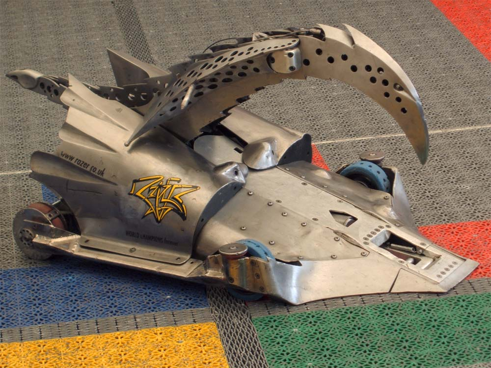

!!!figure right

---

Razer, one of the most successful competitors on _Robot Wars_, won one UK, one European, and two world championships. [Mykeprime, CC BY-SA 2.0]
!!!

**Combat robots**, also referred to as **battlebots**, are remotely controlled robots built for robot-on-robot combat, typically for entertainment purposes.

Combat robotics typically takes the format of a sporting event, with competitive weight classes, live commentary, and rules governing how robots must be designed and what weapons they are allowed to use.

Fights are typically won by knocking out an opponent (rendering it unable to continue operating), removing the robot from the arena, or—if the fight exceeds the time limit—by a judge's decision.

## History

Combat robotics began in 1994 with the creation of the first Robot Wars tournament, held in San Francisco in 1994.

The concept was sold to the BBC in 1995, resulting in the premiere of the first televised robot combat competition, also named _Robot Wars_, in 1998. In the United States, a separate show centred on the same concept, _BattleBots_, premiered in 1999.

The shows would come to differ in that _BattleBots_ would frequently feature professional engineers with significant budgets, whereas _Robot Wars_ encouraged entries by amateur builders.

Early series of _Robot Wars_ didn't focus exclusively on combat, but contained other sports events that robots could compete in individually or in teams. These included sumo wrestling, tug of war, and variants on soccer and pinball. This would itself inspire another BBC programme, _Techno Games_, where competitors built robots to participate in Olympics-style sporting events.

Local and amateur robot combat leagues have since come into existence, usually focused on smaller and amateur builders. Some of these tournaments are broadcast online, such as the [NHRL](https://www.youtube.com/@NHRL).
