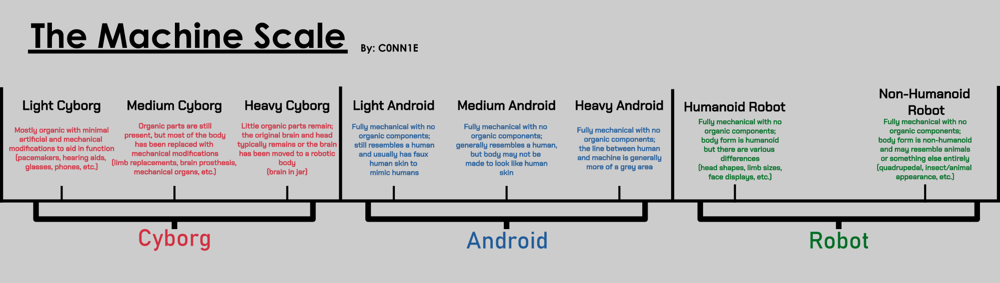

The **Machine Scale** is a method of describing a individual's machine type by judging how much artificial and organic material make up their body and how human or non-human they look.

For physical machines, these can be separated into 3 distinct categories: cyborg, android and robot. The scale was first conceptualized by Twitter user "RobotkinGoddess" (also known as C0NN1E) to give [machine-identified individuals] an easier way to figure out what type of machine they are.

[machine-identified individuals]: {{ 'robotkin' | pageUrl }}

!!!figure

---

[CC BY-SA 4.0]
!!!

## Categories

Many machine-identified individuals have struggled to figure out what kind of machine they are. The Machine Scale was created to provide and more concise method of identifying what kind of a machine a person is. For physical forms, there are 3 distinct categories:

1. **Cyborg:** A cyborg is an individual who sports some form of body modification that aids or improves a certain function.
2. **Android:** An android is an individual who is fully mechanical and artificial, yet still resembles a masculine human in some way. A gynoid is an individual who is fully mechanical and artificial, yet still resembles a feminine human in some way. Alternatively, a machine with masculine and feminine characteristics could be called an androgynoid.
3. **Robot:** A robot is an individual who is fully mechanical and artificial, but share very little in resemblance with humans. Most robots typically retain the general bipedal appearance of a humanoid, but some diverge from that.

## Subcategories

The cyborg side of the scale is based on how much organic and artificial material makes up an individual, ranging from having minor modifications, such as a pacemaker, cybernetic limbs or hearing aids, to a "brain in a jar" scenario. The android and gynoid side of the scale is based on how human-appearing the individual is, ranging from having human like skin, to having only a face the appears human. The robot side of the scale is based on how non-human the individual is, ranging from having a vaguely human stature and bipedal structure, to not appearing as a human at all and having different limb structures.

| Type               | Description                                                                                                                                                              |
| :----------------- | :----------------------------------------------------------------------------------------------------------------------------------------------------------------------- |
| Light cyborg       | Mostly organic with minimal artificial and mechanical modifications to aid in function (pacemakers, hearing aids, glasses, phones, etc.)                                 |
| Medium cyborg      | Organic parts are still present, but most of the body has been replaced with mechanical modifications (limb replacements, brain prosthesis, mechanical organs, etc.)     |
| Heavy cyborg       | Little organic parts remain; the original brain and head typically remains or the brain has been moved to a robotic body (e.g. brain in jar).                            |
| Light android      | Fully mechanical with no organic components; still resembles a human and usually has faux human skin to mimic humans.                                                    |
| Medium android     | Fully mechanical with no organic components; generally resembles a human, but body may not be made to look like human skin.                                              |
| Heavy android      | Fully mechanical with no organic components; the line between human and machine is generally more of a grey area.                                                        |
| Humanoid robot     | Fully mechanical with no organic components; body form is humanoid but there are various differences (head shapes, limb sizes, face displays, etc.)                      |
| Non-humanoid robot | Fully mechanical with no organic components; body form is non-humanoid and may resemble animals or something else entirely (quadrupedal, insect/animal appearance, etc.) |

While the scale is useful for many machine-identified individuals, identity can be described as a ever-changing and complex concept that can't always be attributed to a scale. The machine scale serves merely as a tool to ease in the process of identity and it is not necessarily required to use. Many machine-identified individuals may opt to use words such as "android", "cyborg" or "robot" out of pure preference.
