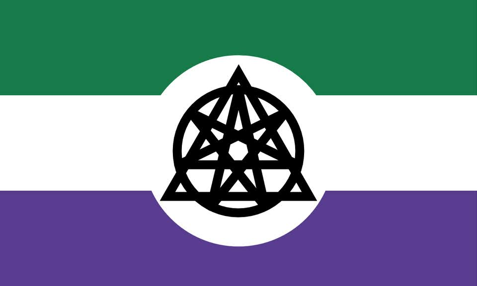

!!!figure right

---

The Nonhuman Unity Flag, combining symbols associated with otherkin, therian, and voidpunk identities. [Synanthrope, copyleft]
!!!

**Nonhuman** is a self-descriptive term for those who identify at least partially as anything other than human. Those who acknowledge that their identity has shifted away from human with time may describe themselves as **ex-human**.

It is adjacent to the [alterhuman] umbrella. Not all nonhumans are alterhuman, as alterhuman is an opt-in term, and not all alterhumans are nonhuman, alterhumanity includes many who identify only as human. Whether any given nonhuman also identifies as [otherkin] is a matter of personal preference.

Nonhuman is an intentionally broad and vague term with minimal requirements for its use. Anybody who is in any way, shape, part, sense, or form other-than-human may opt into referring to themself as nonhuman. Nonhumans may identify as human as well as nonhuman. Many are attracted to the label for its lack of established gatekeepers.

Nonhumans do not necessarily believe themselves to be physically nonhuman. Some do, and many do not. The term nonhuman shouldn't automatically be assumed to mean physically nonhuman.

## History

Modern nonhuman subcultures trace their roots to the late 20th century.[^1]

Various groups based on a shared identity of being elves, such as the Elf Queen's Daughters and the Silver Elves, were formed in the early 1970s. The word "otherkin" was coined in the 1990s in a mailing list for people who identified as elves or other fantasy creatures.

Independently, the draconic (dragon-identifying) and therian (animal-identifying) subcultures arose in the 1990s on Usenet groups.

For years, the most common narrative of how to correctly be otherkin stated that one's soul was that of one's kintype. As robots were perceived as lifeless objects and therefore incapable of having souls, large parts of the otherkin community rejected machine-identified people.[^2]

As a result, many robotkin did not closely identify with the otherkin subculture and formed their own communities. As time passed, the otherkin community became much more open-minded towards previously rejected identities, and robotkin is now seen as an accepted kintype. Still, not all machine-identified people label themselves as otherkin for various reasons and may prefer to use the label nonhuman.

[^1]: _[Otherkin Timeline: The Recent History of Elfin, Fae, and Animal People](http://frameacloud.com/wp-content/uploads/2015/01/Scribner_Timeline2p0.pdf)_ by O. Scribner
[^2]: _[Kill All Humans: My Life As A Robot](https://drive.google.com/file/d/1P9R3s_zlaAhWMzrB5kxw42wmGg2Esn5o/view)_ by Polybius

[otherkin]: {{ 'otherkin' | pageUrl }}
[alterhuman]: {{ 'alterhuman' | pageUrl }}
